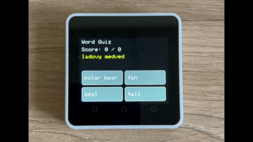

# English Quiz

M5Stack Core2 touch-based vocabulary quiz built with PlatformIO and Arduino.

## Purpose

The app presents a Slovak word meaning and asks the user to select the matching English word from four touch buttons on the Core2 screen.

Current behavior:
- Starts a new shuffled quiz round on boot.
- Uses up to 10 questions per round, or fewer when the active word set is smaller.
- Displays one Slovak meaning and four English answer choices.
- Randomizes both question order and the position of the correct answer.
- Shows immediate color feedback after each answer.
- Displays a final score screen and restarts the round after a screen tap.



## Architecture

- `src/main.cpp` hosts the full app.
- The app uses `M5Core2` LCD and touch APIs directly; no LVGL is involved.
- `QA items[]` contains the built-in vocabulary list.
- Many vocabulary units remain commented out; the current active word set is the `unit 11` block.
- The layout is a 2x2 button grid in the lower half of the display.
- Question text is wrapped manually to fit the top display area.
- Touch locking and release detection prevent press-and-hold from generating duplicate taps.

## Stack

- PlatformIO
- Platform: `espressif32`
- Board: `m5stack-core2`
- Framework: `arduino`
- Library: `M5Core2` `^0.2.0`

## Run

Build:

```sh
pio run
```

Upload:

```sh
pio run --target upload
```

Monitor logs:

```sh
pio device monitor --baud 115200
```

Configuration:

- Vocabulary is defined directly in `src/main.cpp`.
- Enable or replace entries in `QA items[]` to change the active quiz set.
- `ROUND_LEN` is capped at 10 questions per round in `src/main.cpp`.
